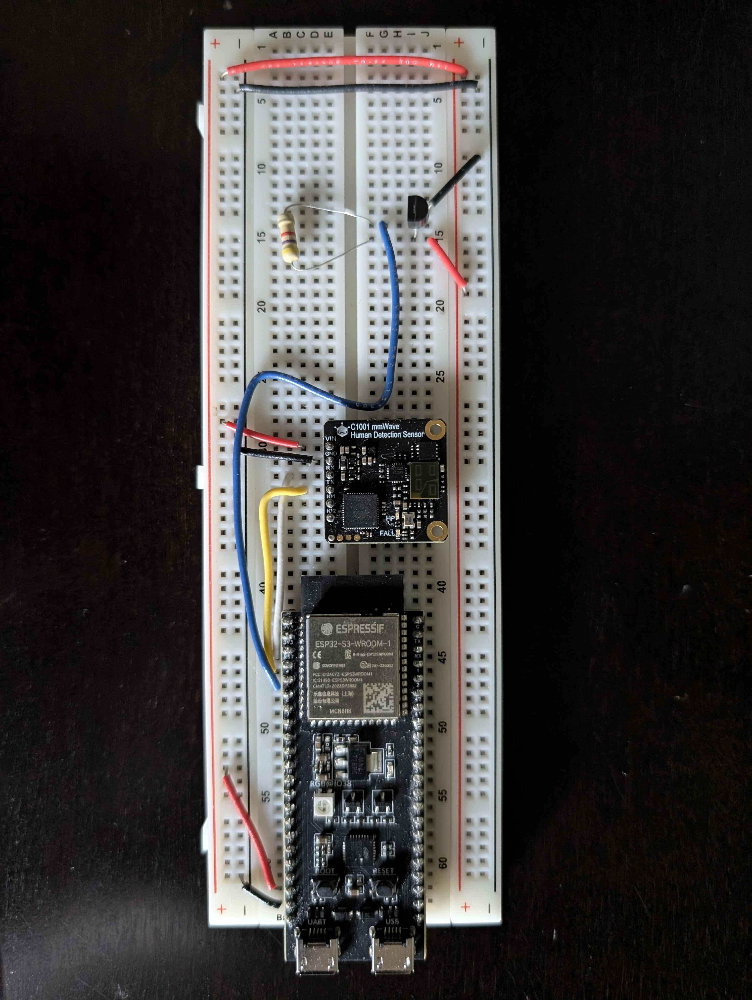

# Sleep Monitoring System

A full-stack embedded system that monitors sleep vitals in real time using an ESP32-S3, a C1001 mmWave radar, and a DS18B20 temperature sensor. Data is transmitted over BLE, stored in PostgreSQL, and displayed on a responsive web dashboard.



---

## Overview

The system is split into three layers:

**Firmware (ESP32-S3)**
- Reads heart rate and breathing rate from a C1001 mmWave radar over UART
- Reads room temperature from a DS18B20 sensor over 1-Wire
- Averages sensor samples over a 10-second window
- Detects presence and automatically opens/closes sleep sessions
- Transmits JSON payloads over BLE using a custom GATT notify characteristic

**C# Server**
- Scans for and connects to the ESP32 over BLE using InTheHand.BluetoothLE
- Reassembles MTU-sized BLE chunks into complete JSON packets
- Persists sessions and readings to PostgreSQL using Entity Framework Core
- Exposes a REST API (ASP.NET Core) for the web dashboard

**Web Dashboard (React + Vite)**
- Live view showing current heart rate, breathing rate, temperature, and connection status
- Session history with start time, duration, and reading count
- Session detail page with heart rate, breathing rate, and temperature charts (Recharts)
- Fully responsive — works on mobile and desktop

---

## Hardware

| Component | Description |
|---|---|
| ESP32-S3 | Main microcontroller |
| C1001 mmWave Radar | Presence, heart rate, and breathing rate |
| DS18B20 | Room temperature (1-Wire, requires 4.7kΩ pull-up) |

**Pin assignments:**

| Signal | GPIO |
|---|---|
| DS18B20 Data | GPIO 6 |
| C1001 TX (ESP32 RX) | GPIO 5 |
| C1001 RX (ESP32 TX) | GPIO 4 |

---

## Project Structure

```
Sleep-Monitoring-Systems/
├── Firmware/                   ESP32-S3 firmware (ESP-IDF)
│   ├── components/
│   │   ├── BLE_Server/         NimBLE GATT server
│   │   ├── UART_C1001_Sensor/  mmWave radar driver
│   │   └── OneWire_DS18B20/    Temperature sensor driver
│   └── main/
│       ├── main.c              Entry point, task creation
│       ├── tasks.c             FreeRTOS sensor and payload tasks
│       ├── payload.c           JSON packet builder
│       └── sleep_data.h        Shared data structure
└── Server/
    ├── ServerBLE/              C# BLE client + database writer
    ├── ServerAPI/              ASP.NET Core REST API
    ├── ServerDB/               EF Core models and DbContext
    └── SleepMonitorWeb/        React + Vite web dashboard
```

---

## Setup

### Requirements

| Tool | Version |
|---|---|
| ESP-IDF | v6.0 |
| .NET | 10 |
| PostgreSQL | 18 |
| Node.js | 20+ |
| Windows | 10 (build 19041+) or 11 — required for WinRT BLE APIs |

---

### 1. Firmware

```bash
cd Firmware
idf.py build
idf.py flash monitor
```

The C1001 sensor takes approximately 30 seconds to initialise on first boot.

---

### 2. Database

1. Install PostgreSQL and open pgAdmin
2. Create a database named `sleep_monitor`

---

### 3. C# Server

**Configure the connection string**

In `Server/ServerBLE/` create `appsettings.Local.json`:

```json
{
  "ConnectionStrings": {
    "DefaultConnection": "Host=localhost;Port=5432;Database=sleep_monitor;Username=postgres;Password=YOUR_PASSWORD"
  }
}
```

**Run the BLE server**

```bash
cd Server/ServerBLE
dotnet run
```

The server will scan for the ESP32, connect over BLE, and save readings to PostgreSQL automatically.

---

### 4. REST API

**Configure the connection string**

In `Server/ServerAPI/` create `appsettings.Development.json`:

```json
{
  "ConnectionStrings": {
    "DefaultConnection": "Host=localhost;Port=5432;Database=sleep_monitor;Username=postgres;Password=YOUR_PASSWORD"
  },
  "Cors": {
    "AllowedOrigins": "http://localhost:5173"
  }
}
```

**Run the API**

```bash
cd Server/ServerAPI
dotnet run
```

API available at `http://localhost:5022`. Swagger UI at `http://localhost:5022/swagger`.

---

### 5. Web Dashboard

```bash
cd Server/SleepMonitorWeb
npm install
npm run dev
```

Dashboard available at `http://localhost:5173`.

---

## How It Works

1. The ESP32-S3 boots and starts advertising over BLE as `SleepMonitor`
2. The C# server scans, connects, and subscribes to GATT notifications
3. When the C1001 detects presence and locks onto vitals, the ESP32 sends a `session_start` packet followed by `reading` packets every 10 seconds
4. Each reading contains averaged heart rate, breathing rate, temperature, apnea events, and sleep disturbance code
5. When the person leaves the sensor range for 30 seconds, a `session_end` packet is sent and the session is closed in the database
6. The web dashboard polls the REST API every 10 seconds to display live data and historical sessions

---

## API Endpoints

| Method | Endpoint | Description |
|---|---|---|
| GET | `/api/Sessions` | All sessions, most recent first |
| GET | `/api/Sessions/{id}` | Single session by ID |
| GET | `/api/Readings/session/{id}` | All readings for a session |
| GET | `/api/Readings/latest` | Most recent reading |
| GET | `/api/Readings/status` | BLE connection status |
